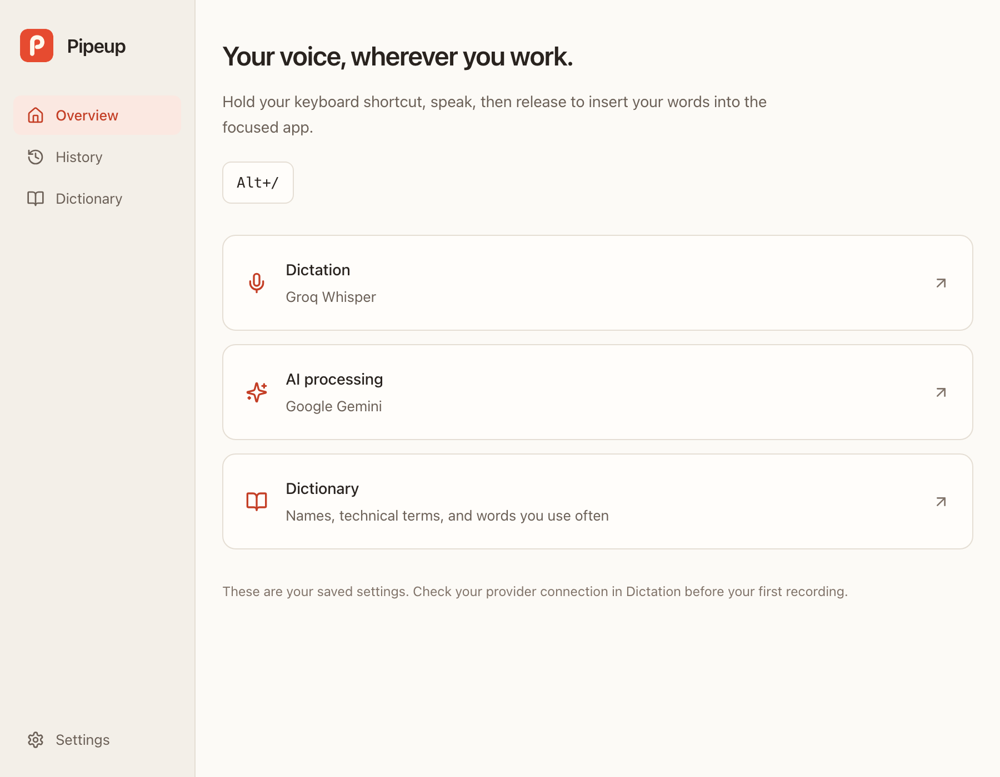
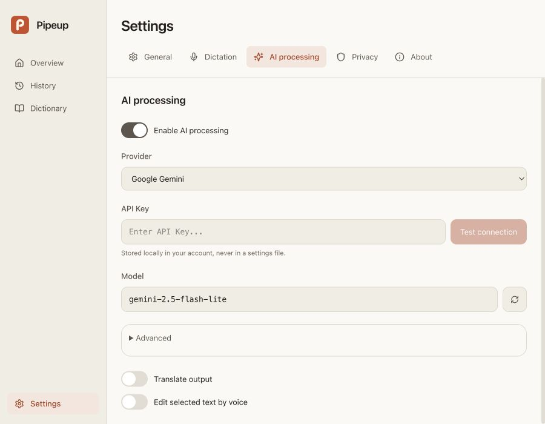

<p align="center">
  
</p>

<h1 align="center">Pipeup</h1>

<p align="center">Voice input for people who want control over their tools.</p>

<p align="center">
  <a href="https://github.com/azhurb/pipeup/releases">Download</a> ·
  <a href="docs/index.md">Documentation</a> ·
  <a href="CONTRIBUTING.md">Contribute</a>
</p>



Hold your keyboard shortcut, speak, and Pipeup transcribes into the focused app. Choose your speech provider and bring your own API key. Add optional AI processing to clean up, format, or translate the result.

Built for developers and people comfortable with API keys, models, and desktop permissions. Available for macOS, Windows, and Linux.

- **Your providers.** Configure speech recognition separately from AI processing. Use dictation without an LLM, or connect a supported cloud model or local Ollama model for processing.
- **A quiet interface.** A small, text-free capsule shows recording and processing. Hover or focus to cancel. Light, dark, and system themes keep the rest of the app consistent.
- **Useful local tools.** Keep a dictionary of specialist terms, review recent dictations, and choose whether history is saved and how long it is retained.

<details>
<summary>Provider settings</summary>



Screenshots use the real interface with preview data.

</details>

## Download and setup

Get an installer from [Releases](https://github.com/azhurb/pipeup/releases). Check the release title: older releases are named OpenTypeless.

| Platform | Download |
| --- | --- |
| macOS | `.dmg` matching Apple Silicon or Intel |
| Windows | `.msi` installer |
| Linux | `.AppImage` or `.deb` |

1. Install and grant the requested microphone and desktop permissions.
2. Choose a speech provider and enter its API key. Provider accounts and usage charges are separate from Pipeup.
3. Optionally configure AI processing with an LLM provider and model. You can skip this step.
4. Use your keyboard shortcut in the app where you want to type.

Speech providers include Deepgram, AssemblyAI, Gemini Transcribe, OpenAI Whisper, Groq, GLM-ASR, and SiliconFlow. Supported models and languages depend on the provider. See the [provider reference](docs/architecture/providers.md).

### macOS

Current release builds use a self-signed certificate rather than Apple Developer ID notarization. After downloading a release you trust, drag **Pipeup.app** into `/Applications`, then remove its quarantine attribute if macOS blocks opening it:

```bash
xattr -cr /Applications/Pipeup.app
```

Grant **Microphone** and **Accessibility** permissions when prompted. Repeat the quarantine step after an update if necessary. See [troubleshooting](docs/references/troubleshooting.md) for permission problems.

### Upgrading from OpenTypeless or an earlier Pipeup build

Pipeup now installs with its own app identity, so it can coexist with OpenTypeless. On first launch, if data exists under the old shared identity, Pipeup offers to import a copy of settings, history, dictionary, and available provider keys. Quit the old app before importing. You can also start fresh. Either choice leaves the old app and its data untouched.

The import turns off Pipeup's Launch at Startup setting. Re-enable it after setup if you want both apps to start at login. If both apps are running, give them different keyboard shortcuts. On macOS, grant Microphone and Accessibility to **Pipeup** as a separate app. An existing OpenTypeless permission entry does not grant Pipeup access. See [troubleshooting](docs/references/troubleshooting.md) if dictation cannot paste.

## Data and privacy

Audio goes directly to your configured speech provider. With AI processing enabled, transcript text and relevant context go directly to your configured LLM provider. Provider privacy and retention policies apply. Pipeup has no account service, subscription, telemetry, or automatic updater.

Settings, dictionary, and optional history are stored locally. History searches the most recent 200 entries; clearing history deletes all stored entries. Retention can automatically remove older entries.

API keys are stored separately from settings. On macOS, they use an unencrypted, owner-only file with `0600` permissions. On Windows and Linux, Pipeup uses the OS credential store with a local file fallback when it is unavailable. Existing plaintext settings keys migrate into credential storage. See the [storage reference](docs/architecture/storage.md) for details.

Local Ollama support applies to AI processing. Pipeup does not bundle a speech model or promise offline dictation.

## Known limits

- Output uses clipboard paste into the focused app. Some applications or permission settings can prevent insertion.
- Voice editing of selected text is macOS-only and requires AI processing. It depends on Accessibility support in the target app; Monaco editors such as VS Code and Cursor do not expose the needed selection.
- Release downloads and platform support are described in each release's notes. A local macOS build does not verify Windows or Linux packaging.

## Development

Install Node.js 20.19+ or 22.12+, Rust stable, and the [Tauri platform prerequisites](https://v2.tauri.app/start/prerequisites/).

```bash
npm ci
npm run tauri dev
```

Use the [command reference](docs/references/commands.md) for production builds and checks, and [CONTRIBUTING.md](CONTRIBUTING.md) for contribution guidance. Architecture and behavior documentation starts at [docs/index.md](docs/index.md).

## Credits

Pipeup builds on [OpenTypeless](https://github.com/tover0314-w/opentypeless) by [Tover0314](https://github.com/tover0314-w). This fork retains the local bring-your-own-key pipeline and develops its own interface and product identity. The original author's copyright and MIT license are preserved.

[MIT license](LICENSE) · [Security policy](SECURITY.md) · [Product direction](VISION.md)
